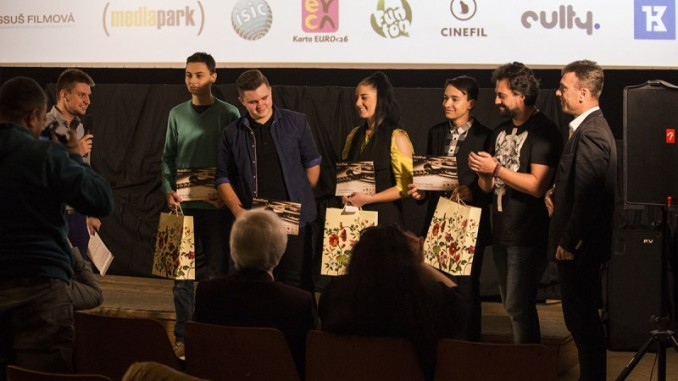
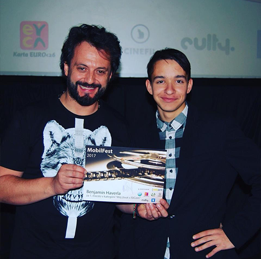

# Marián Čekovský – motivational chat

When I created at the age of 16 music video about "[Life with ISIC](https://www.youtube.com/watch?v=07TXVp8rjss)", I had the opportunity to talk with the famous Slovak musician, singer, songwriter, comedian and presenter Marián Čekovský.

I remember how my father mentioned that he positively enjoyed the music video. After the award ceremony, we met, and he said,

**`Great job! Keep going!`**

Hearing this honest sentence from him motivated me to continue on my filmmaking path.

-------------------------------------------------------------

# BACK TO THE...
## [Main Page (English for designers)](https://github.com/BenjaminHaverla/English-for-designers.git)
## [ABOUT ME](https://github.com/BenjaminHaverla/Main-about-me.git)
## [Benjamín Haverla – Who am I ?](https://github.com/BenjaminHaverla/First-impression.git)
## [English essay – AWESOME](https://github.com/BenjaminHaverla/English-essay-workflow.git)
# Contact me:
## **Mail**: haverla.tros@gmail.com

-------------------------------------------------------------

#### [<– BACK](https://github.com/BenjaminHaverla/Main-about-me.git)
